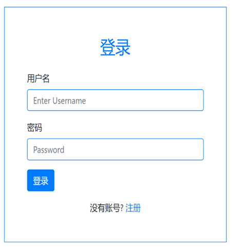
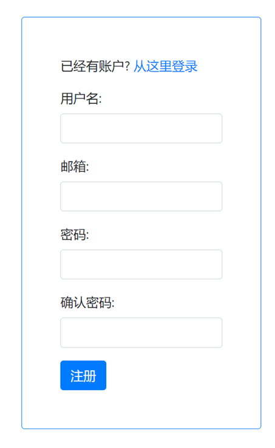
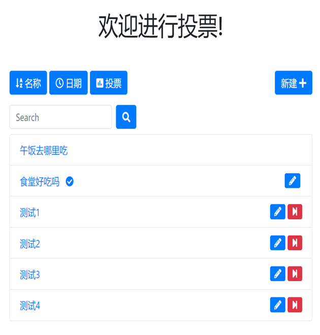
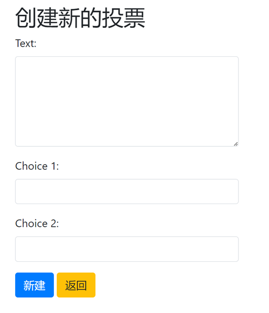
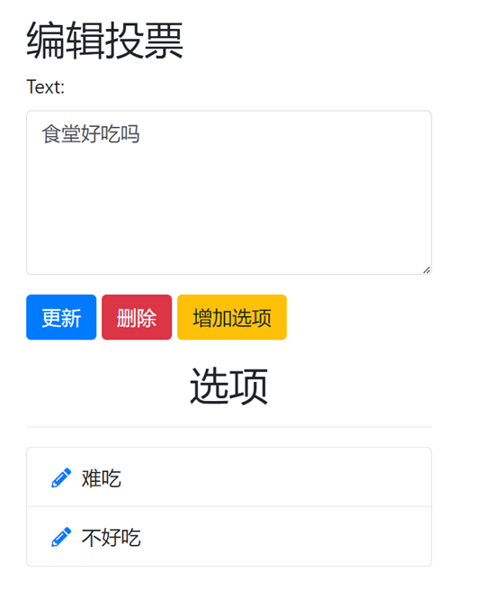
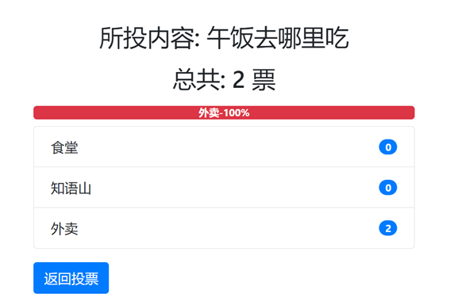

# Poll-App-Diang

## 一个基于Django的全功能的投票应用程序
1. 注册才能显示调查并投票
2. 已投票，无法再次投票
3. 只有调查的所有者​​可以添加调查、编辑调查、更新调查、删除调查、添加选项、更新选项、删除选项和结束调查
4. 如果投票结束，则无法进行投票
5. 已结束的调查仅向用户显示调查的最终结果
6. 有一个调查搜索选项
7. 用户可按名称、发布日期和投票数过滤调查

















要迁移数据库
```
python manage.py makemigrations
python manage.py migrate
```

使用管理面板，创建超级用户
`python manage.py createsuperuser`

创建一些虚拟文本数据：
`pip install faker`  `python manage.py shell`  `import seeder`  `seeder.seed_all(30)`
这里30是条目的数量

运行该程序
`python manage.py runserver`
在浏览器中访问`http://127.0.0.1:8000`
